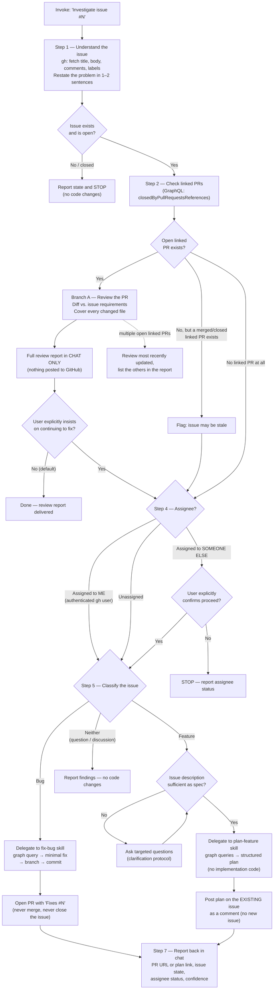

# investigate-issue — Workflow Diagram

The full flow of `SKILL.md`, as agreed in the skill specification.

## Guardrails (apply everywhere)

- Never merges a PR, never closes the issue, never pushes to main.
- Review reports go to chat only — nothing is posted to GitHub in Branch A.
- No code work while an open linked PR exists or another person's
  assignment is unconfirmed.
- Never creates a new issue — the feature plan is a comment on the
  existing one.
